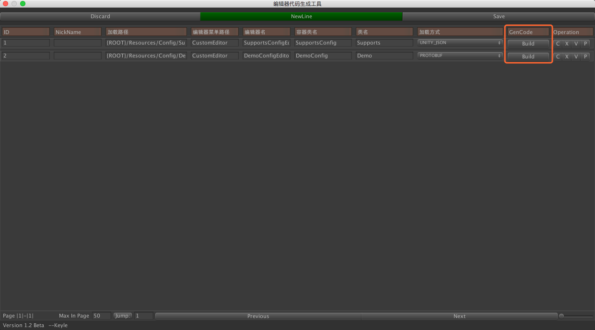

# UNITY3D-DATA-VIEWER
UNITY3D 可视化数据编辑器 / UNITY3D EDITOR DATA_VIEWER .
<br/>

UNITY3D-DATA-VIEWER项目是客户端配置文件解决方案。它的初衷是加速工作流程，<code>程序写好类策划就能配，运行就能跑!</code>


# 特性
* 1. 节约程序大量编辑器开发时间。
* 2. 在定义完成基础类型的时候，即可同步生成可视化编辑器。
* 3. 所见即所得不需要重复从excel导数据到Unity。
* 4. 自动化流程不易出错，如外联Check，基础类型检查等。
* 5. 强扩展性，自定义行数据逻辑检查，扩展按钮，扩展编辑器事件等。
* 6. 无缝支持Unity内建类型，vector2/vector3/vector4/color/bounds/curves 与数据基础类型等。
* 7. 多种存储格式选择
* ...


```
└── SmartDataViewer
    ├── Assets
    │   ├── 3rdPlugins
    │   │   ├── SmartDataViewer  编辑器源代码目录
    │   │   │   ├── CTS                模版
    │   │   │   ├── Config             内建配置
    │   │   │   ├── Editor             内建编辑器目录
    │   │   │   │   ├── BuildInEditor  
    │   │   │   │   └── ModelDesign
    │   │   │   ├── EditorResources    内建编辑器资源目录
    │   │   │   └── Script             用户需要使用到的代码
    │   │   │       ├── Container
    │   │   │       └── Helpers
    │   │   └── proto-net              使用protobuf需要用到到此库
    │   │       ├── Compiler
    │   │       ├── Meta
    │   │       ├── Properties
    │   │       ├── Serializers
    │   │       ├── ServiceModel
    │   │       ├── Web
    │   │       └── obj
    │   │           ├── Debug
    │   │           └── Profile
    │   ├── DemoEntity                 测试用的实体类
    │   ├── Editor                     代码生成器导出目录
    │   │   └── Export                 导出的编辑器代码会在这儿
    │   └── Resources                  资源目录(可在生成器中修改)   
    │       └── Config

```


# Current Version 1.3.0 BETA

初次尝试请直接在UNITY菜单中选择 <code>SmartDataViewer/Code Generator -> GenCode列中的 Build按钮 </code> 即可在工程中创建编辑器导出路径 <code>Editor/Export/</code> 。其中有已经成功生成的编辑器脚本。


您在Unity最上的菜单栏 <code>CustomEditor</code> 中看到对应的编辑器。


## Video on YouTube

视频暂时不录


# 正确的打开姿势 / Tutorial
## 1.创建容器 / Create Container
在下面这个例子中由于使用了protobuf序列化，在 DemoConfig 中您可以看到 <code>ProtoMember ProtoContract ProtoInclude</code>标签。
我们主要关注如下标签 <code>ConfigEditor 与 ConfigEditorField</code> 

```
ConfigEditor       属性配置您可以在 SmartDataViewer/Editor Setting 中的 Custom 配置。
ConfigEditorField  属性配置您可以在 SmartDataViewer/Control Setting 中的 Custom 配置。
```


Type 1
``` cs
[ProtoContract]  
[Serializable][ConfigEditor(2)]
public class DemoConfig : ConfigBase<Demo> { }

[ProtoInclude(29,typeof(IModel))]
[ProtoContract]  
[Serializable]
public class Demo : IModel
{
	public Demo()
	{
		strList = new List<string>();
		list = new List<int>();
		supports = new List<int>();
		description = string.Empty;
	}

	[ProtoMember(3)]
	public List<string> strList;

	[ProtoMember(4)]
	public List<int> list;

	[ProtoMember(5)]
	[ConfigEditorField(19)]
	public List<int> supports;

	[ProtoMember(6)]
	public string description;

	[ProtoMember(7)]
	[ConfigEditorField(19)]
	public int support;
}
```


Type 2
``` cs

[Serializable][ConfigEditor(1)]
public class SupportsConfig : ConfigBase<Supports> { }

[Serializable]
public class Supports : IModel
{
	public Supports()
	{
		testFloat = 0;
		boolList = new List<bool>();
		description = string.Empty;
		colorList = new List<Color>();
		curveList = new List<AnimationCurve>();
		curve = new AnimationCurve();
		bounds = new Bounds();
		boundsList = new List<Bounds>();
		descriptionList = new List<string>();
		testPointlist = new List<Vector2>();
		testPointlist3 = new List<Vector3>();
		testPointlist4 = new List<Vector4>();
		floatList = new List<float>();
	}
	
	[ConfigEditorField(1)]
	public string description;
	
    [ConfigEditorField(2)]
	public Vector2 testPoint;
	
	[ConfigEditorField(3)]
	public Vector3 testPoint3;
	
	[ConfigEditorField(4)]
	public Vector4 testPoint4;

	[ConfigEditorField(5)]
	public List<bool> boolList;

	[ConfigEditorField(6)]
	public int testID;

	[ConfigEditorField(7)]
	public float testFloat;
	
	[ConfigEditorField(8)]
	public Bounds bounds;

	[ConfigEditorField(9)]
	public Color PointColor;

	[ConfigEditorField(10)]
	public AnimationCurve curve;
	
	[ConfigEditorField(11)]
	public List<string> descriptionList;
	
	[ConfigEditorField(12)]
	public List<Vector2> testPointlist;
	
	[ConfigEditorField(13)]
	public List<Vector3> testPointlist3;
	
	[ConfigEditorField(14)]
	public List<Vector4> testPointlist4;
	
	[ConfigEditorField(15)]
	public List<Color> colorList;

	[ConfigEditorField(16)]
	public List<AnimationCurve> curveList;

	[ConfigEditorField(17)]
	public List<Bounds> boundsList;

	[ConfigEditorField(18)]
	public List<float> floatList;
}

```


## 3.生成代码 / Click Build Button
点击build按钮 则会在指定路径生成数据编辑器



## 完成 / Complete


# 如何加载数据？ ／ How to Load Data ?

``` cs
//读取
ConfigContainerFactory.GetInstance().LoadConfig<{实体类型}>({读取路径});

//删除
ConfigContainerFactory.GetInstance().DeleteFromDisk({删除路径})

//保存
ConfigContainerFactory.GetInstance({存储格式}).SaveToDisk({输出路径}, {序列化的实例})

//查询
var subType = c.SearchByID({ID});
var subType2 = c.SearchByNickName({NickName});
```


# Next Version 

下个版本核心：
1. 增加 Model Design 面板用来给策划设计实体类并且支持实体类代码生成，实现流程自动化。
2. 补全更多的数据序列化格式。

敬请期待。

